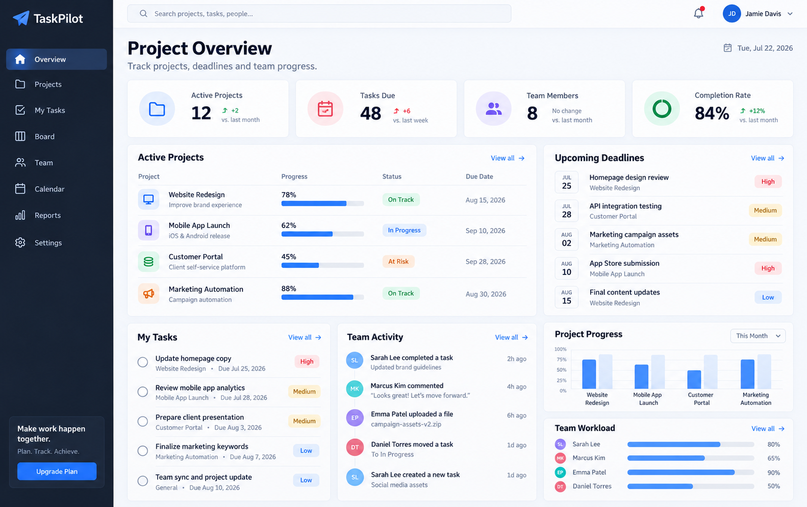
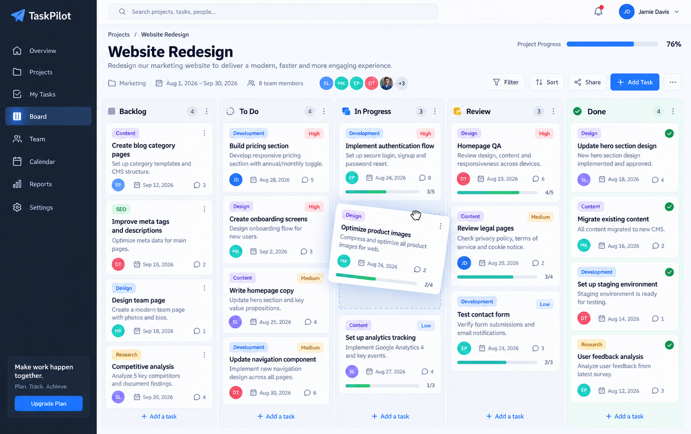
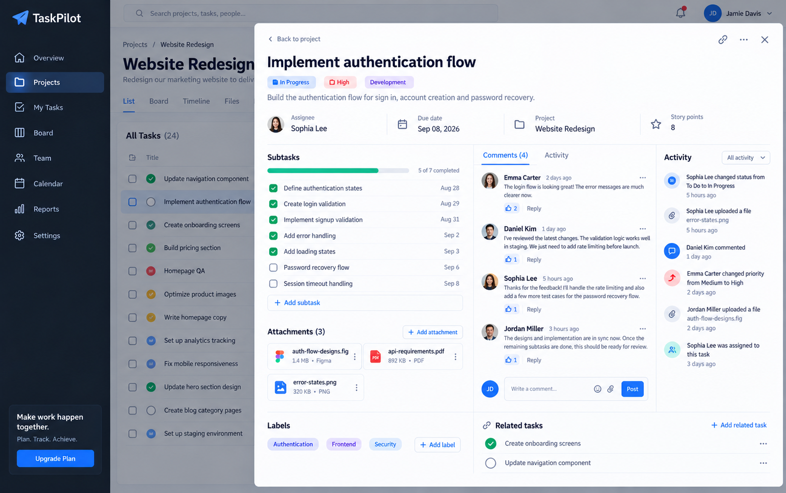

# Task Management App

A modern task management application concept designed to showcase Kanban workflows, project tracking, team collaboration, priorities, deadlines, and responsive dashboard interfaces.

## Overview

This project demonstrates a clean and structured project management experience suitable for software teams, agencies, startups, internal teams, and collaborative business workflows.

The application focuses on organizing projects, managing tasks, tracking progress, assigning work, and supporting team collaboration through a practical and easy-to-use interface.

## Project Preview

### Project Overview Dashboard

### Kanban Task Board

### Task Details & Team Collaboration

## Features

- Project overview dashboard
- Kanban task management
- Project progress tracking
- Task priorities
- Due dates
- Team assignments
- Task status management
- Subtasks and checklists
- Comments and collaboration
- Activity tracking
- Search and filtering
- Responsive application layout
- Reusable React components

## Tech Stack

- React.js
- JavaScript
- Node.js
- REST APIs
- HTML5
- CSS3

## Sample Component

The repository includes a `TaskBoard.jsx` component demonstrating a simple task board structure with task statuses, priorities, and reusable task data.

## Typical Workflow

The application concept follows a common project management workflow:

`Project → Tasks → Assignment → In Progress → Review → Completed`

A production implementation can be extended with authentication, role-based access, notifications, file attachments, real-time collaboration, reporting, and backend persistence.

## Use Cases

This application concept can be adapted for:

- Software development teams
- Agencies
- Internal project management
- Startup teams
- Product development workflows
- Marketing teams
- Client project tracking
- Collaborative business applications

## Project Purpose

This is an independent demonstration project created to showcase project management workflows, Kanban interfaces, React component patterns, and collaborative application concepts.

The project uses fictional users, projects, tasks, and data and is not based on or connected to any confidential client project.

---

**Built by Sumit Kumar**  
Full-Stack Developer | React • Next.js • Node.js • APIs & AI Integrations
